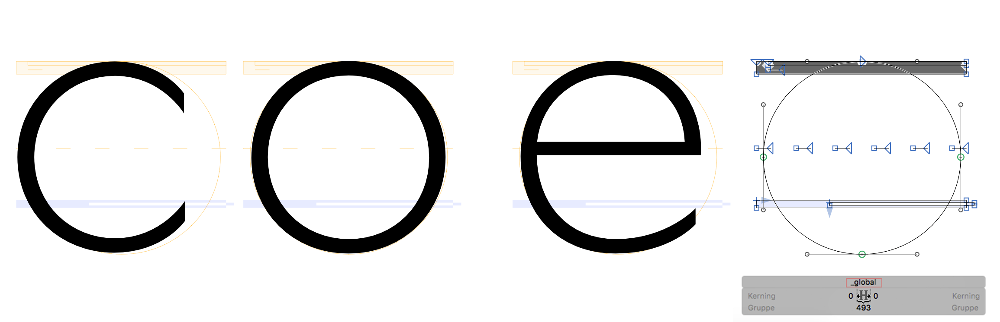
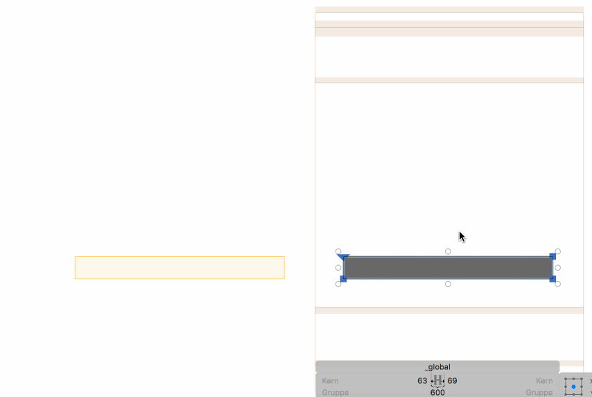

# Show Global Glyph

## Plugin for Glyphsapp

This is a Plugin for the great [Glyphs Font Editor](http://glyphsapp.com/).

It displays a Glyph called *_global* in the Background of other Glyphs. 
This can give an alternative to Global Guidelines.

### How to use

You have do add a glyph called *_global* and it will show in the background of each glyph when *View > Show Global Glyph* is turned on.
Now you can draw any form or stroke, and it will show behind every other glyph.

To show only strokes use a overlaid double path (see screenshot below). That gives you the choice between just lines and filled form.

Use *open contours* to draw *blue* fields (see screenshot below).

### Examples

Some tricks on how to build those elements ...

### Installation

Go to *Window > Plugin Manager,* find *Global Glyph* there, and click on the *Install* button next to it.

### Pull Requests

Feel free to comment or pull requests for any improvements.

### License

Made possible with the GlyphsSDK by Georg Seifert (@schriftgestalt) and Rainer Erich Scheichelbauer (@mekkablue).

Licensed under the Apache License, Version 2.0 (the "License");
you may not use this file except in compliance with the License.
You may obtain a copy of the License at

http://www.apache.org/licenses/LICENSE-2.0

Unless required by applicable law or agreed to in writing, software
distributed under the License is distributed on an "AS IS" BASIS,
WITHOUT WARRANTIES OR CONDITIONS OF ANY KIND, either express or implied.
See the License for the specific language governing permissions and
limitations under the License.
