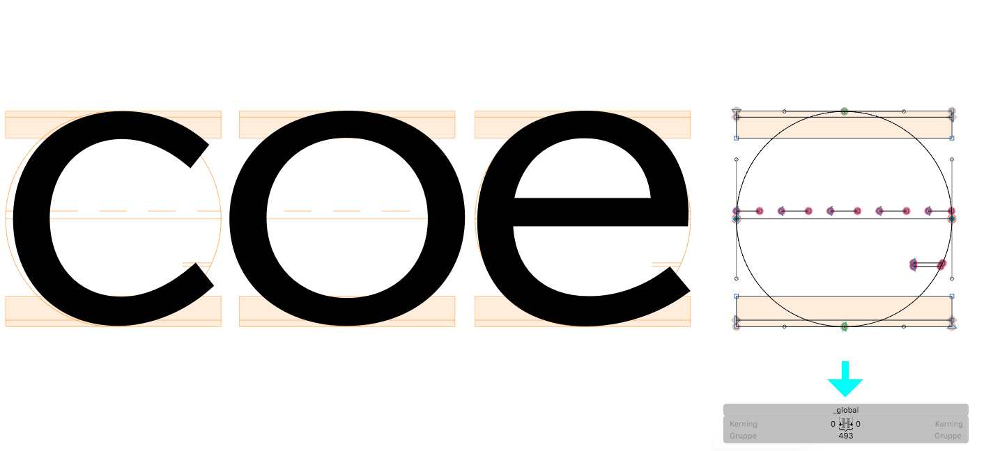

# Show Global Glyph

## Plugin for Glyphsapp

This is a Plugin for the [Glyphs font editor](http://glyphsapp.com/). It displays a Glyph called *_global* in the Background of other Glyphs. This can give an alternative to Global Guidelines.

### How to use

Download or clone the whole `Glyphsapp-Plugins`repo (it will contain more plugins soon) and copy the `ShowNodeCount.glyphsReporter` into your Glyphsapp Plugins folder (eg. `/Library/Application\ Support/Glyphs/Plugins`), restart Glyphs and when ever you need it, toggle Plugin from the view menu.

### Examples

### Known issues

- None so far

### ToDo

- SIEHE PLUGIN

### Pull Requests

Feel free to comment or pull requests for any improvements.

### License

Made possible with the GlyphsSDK by Georg Seifert (@schriftgestalt) and Rainer Erich Scheichelbauer (@mekkablue).

Licensed under the Apache License, Version 2.0 (the "License");
you may not use this file except in compliance with the License.
You may obtain a copy of the License at

http://www.apache.org/licenses/LICENSE-2.0

Unless required by applicable law or agreed to in writing, software
distributed under the License is distributed on an "AS IS" BASIS,
WITHOUT WARRANTIES OR CONDITIONS OF ANY KIND, either express or implied.
See the License for the specific language governing permissions and
limitations under the License.
